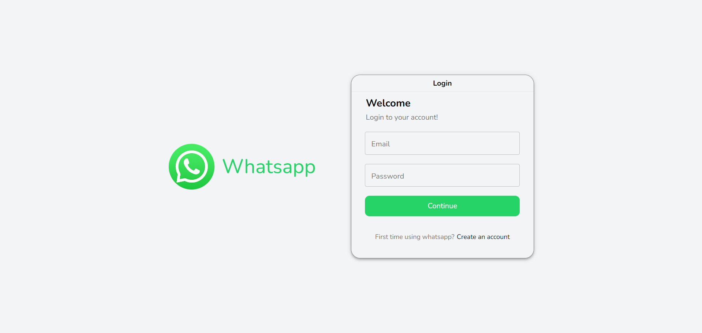
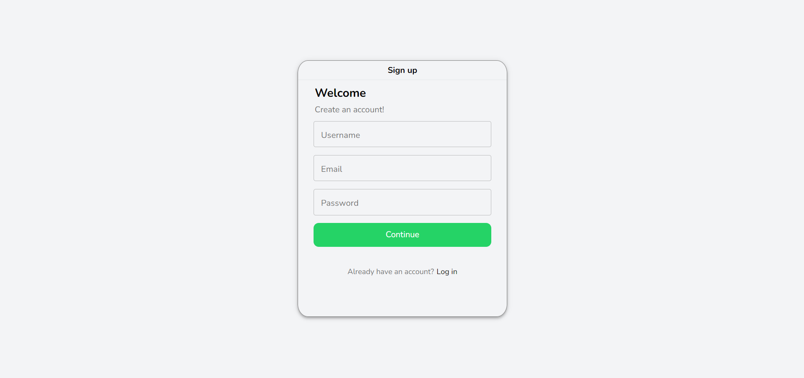
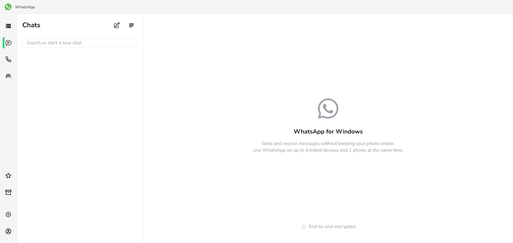
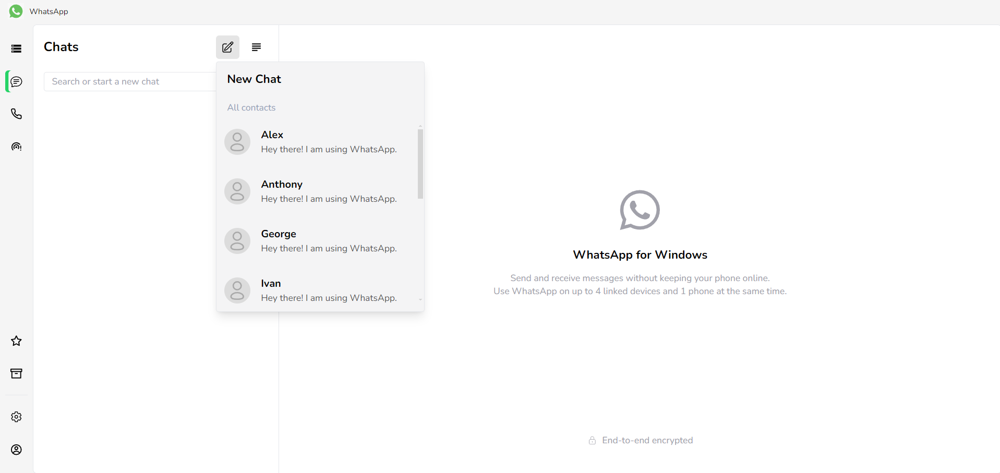
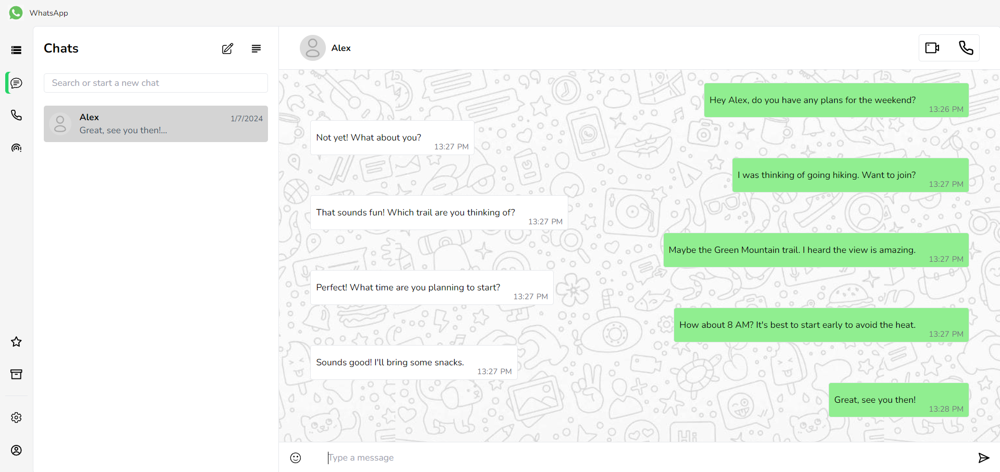

# WhatsApp

This is an WhatsApp clone built with React, Vite, Tailwind CSS, MongoDB, Express, Socket IO.

### Features

- **User Authentication**: Secure login and registration system.
- **User Search**: Find and connect with other users easily.
- **Real-Time Messaging**: Interactive map with Leaflet for locating properties.
- **Chat History**: Access past conversations with an easy-to-use interface..
- **Backend API**: Express server with MongoDB for data management.

## Screenshots

